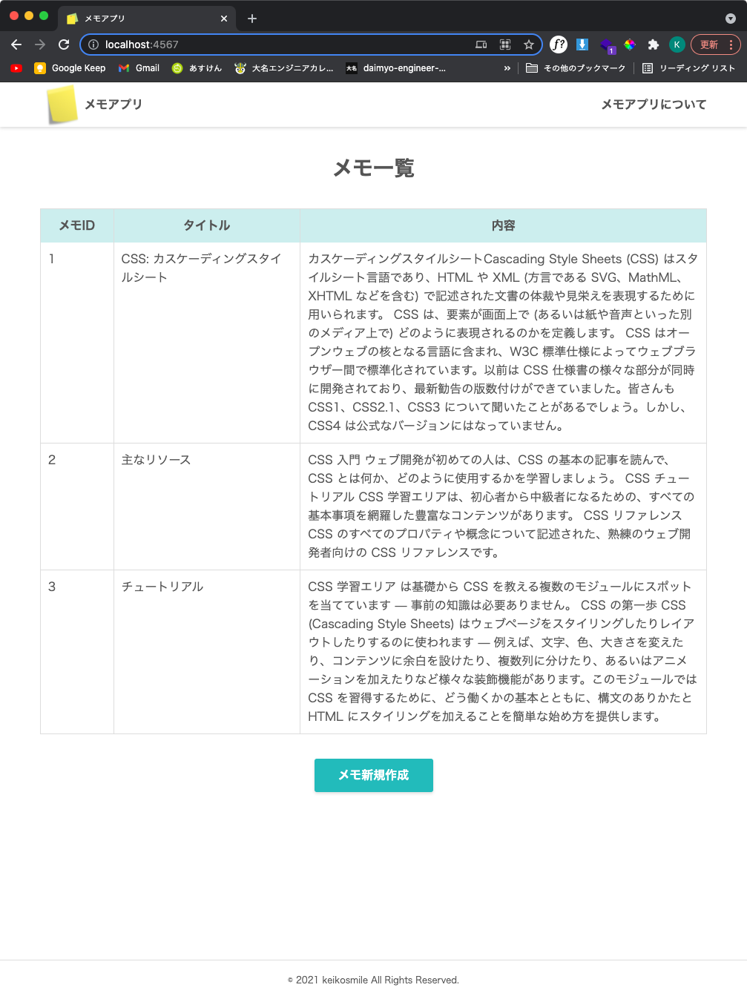

# sinatra_memo_pg メモアプリ pg編
## 【概要】

メモをネット上で共有するためのアプリです。

## 【ローカルのPCで メモアプリ を立ち上げるための手順】

### 1. ローカルのPCでpostgreSQLを準備する
1. postgreSQLをインストールする
    - macOSの場合
        - `brew install postgresql`
    - linuxの場合
        - `sudo apt install postgresql`
2. postgreSQLを起動する
    - macOSの場合
        - `brew services start postgresql`
    - linuxの場合
        - `sudo service postgresql start`
3. memoデータベースを作成する
    1. インストール時に自動的に作成された postgresデータベースに接続する
        - `psql -d postgres`
    2. memoデータベースを作成する
        - `CREATE DATABASE memo;`
    3. postgresデータベースから切断する
        - `\q`
4. memoデータベースに接続する
    - `psql -d memo`
5. Memosテーブルを作成する
    - ```SQL
      CREATE TABLE Memos
      ( memo_id VARCHAR(36)  NOT NULL,
        title   VARCHAR(30)  NOT NULL,
        body    VARCHAR(500),
        PRIMARY KEY (memo_id));
      ```
6. memoデータベースから切断する
    - `\q`
### 2. ファイルをダウンロードする
-  ファイル構成
    - public/
      - css/
          - style.css
      - img/
          - memo.ico
          - post-it.jpg
          - READEME_.png
      - js/
          - input_limit.js
          - table_click.js
    - views/
      - about.erb
      - detail.erb
      - edit.erb
      - error.erb
      - index.erb
      - layout.erb
      - new.erb
    - .gitignore
    - .rubocop.yml
    - Gemfile
    - Gemfile.lock
    - main.rb
    - README.md

### 3. gem をインストールする
- `bundle install`

### 4. Webアプリケーションを起動する
- `bundle exec ruby main.rb`

### 5. ブラウザで下記にアクセスする
- http://localhost:4567

## 【ローカルのPCで メモアプリ を停止する手順】
### 1. 実行中のWebアプリケーションを停止する
- ターミナルで、Ctrl-C
### 2. postgreSQLを停止する
- macOSの場合
    - `brew services stop postgresql`
- linuxの場合
    - `sudo service postgresql stop`

